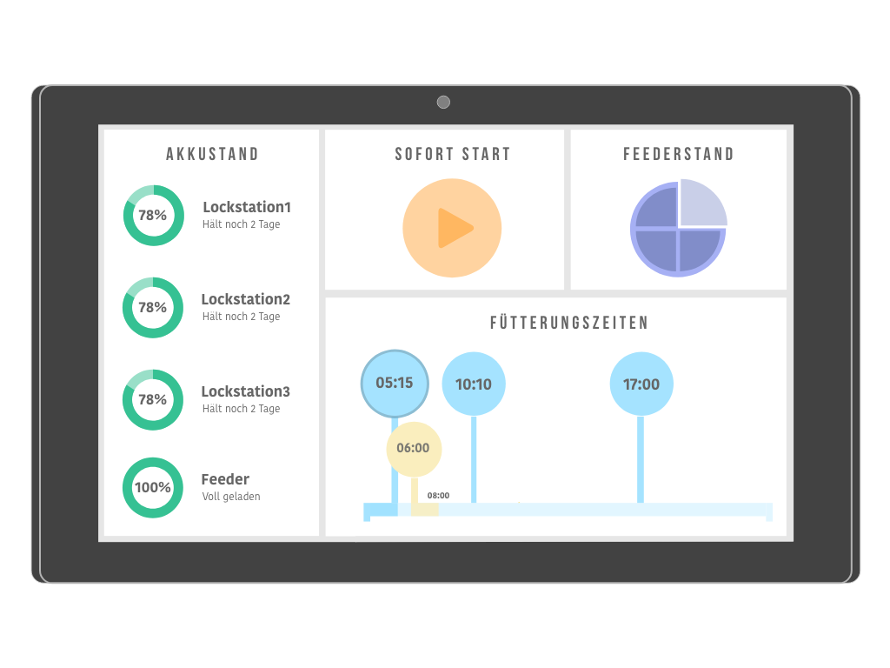

# Frontend

## Funktion

Das PaceBreaker Frontend ist ein technischer Prototyp für das Pflegerinterface, welcher verwendet wird um Jagten über einen Tag hinweg zu planen und zu starten. Es handelt sich hierbei um eine HTML Seite, die über eine Javascript Library MQTT Befehle an das Backend sendet.
In der Debug Konsohle und einer Textbox unten auf der Seite werden die Console-Logs des Backends ausgegeben.

## Ausführen
Um das Frontend auszuführen muss die HTML Seite in einem Browser geladen werden.

## To-Do
- Frontend Interface aufmotzen 

